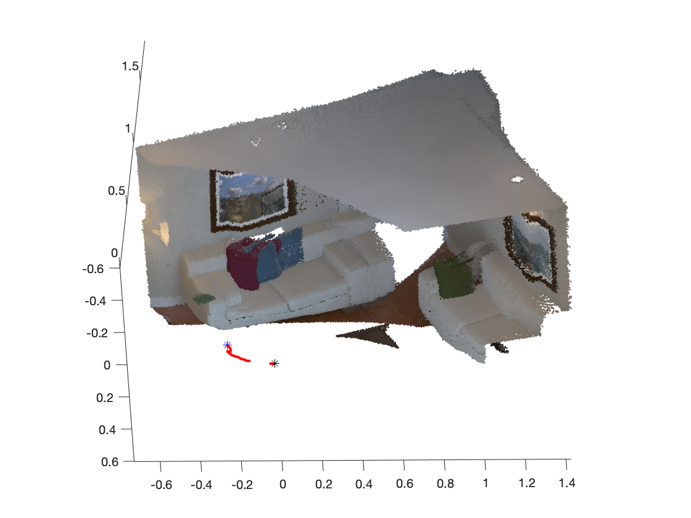
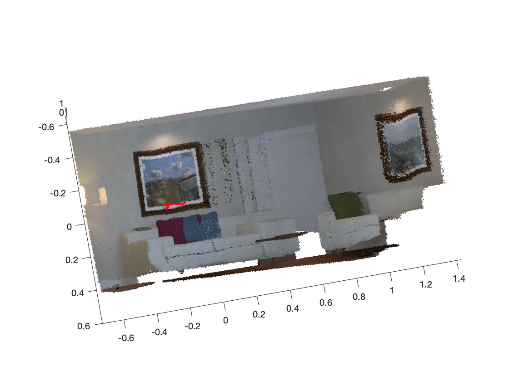
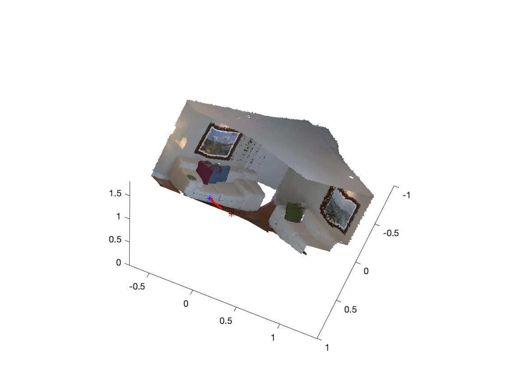
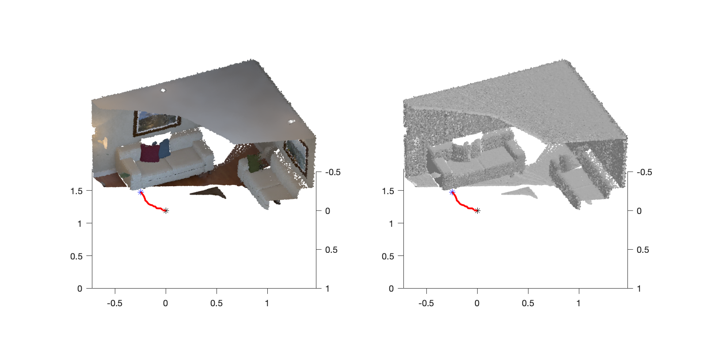
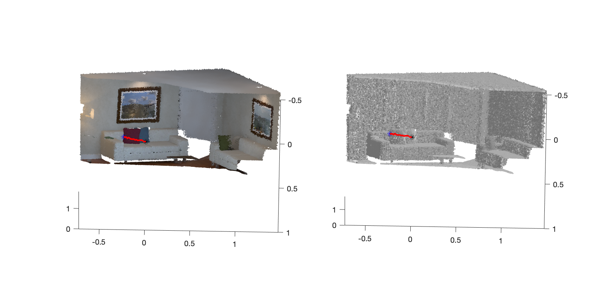
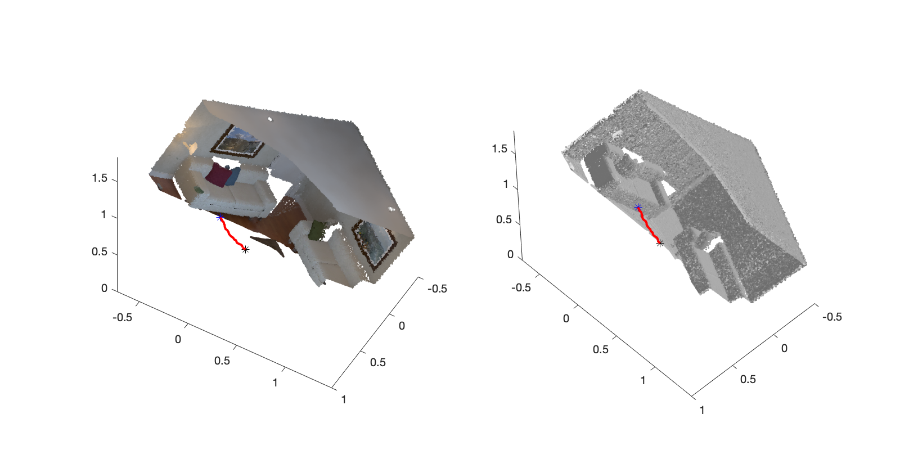
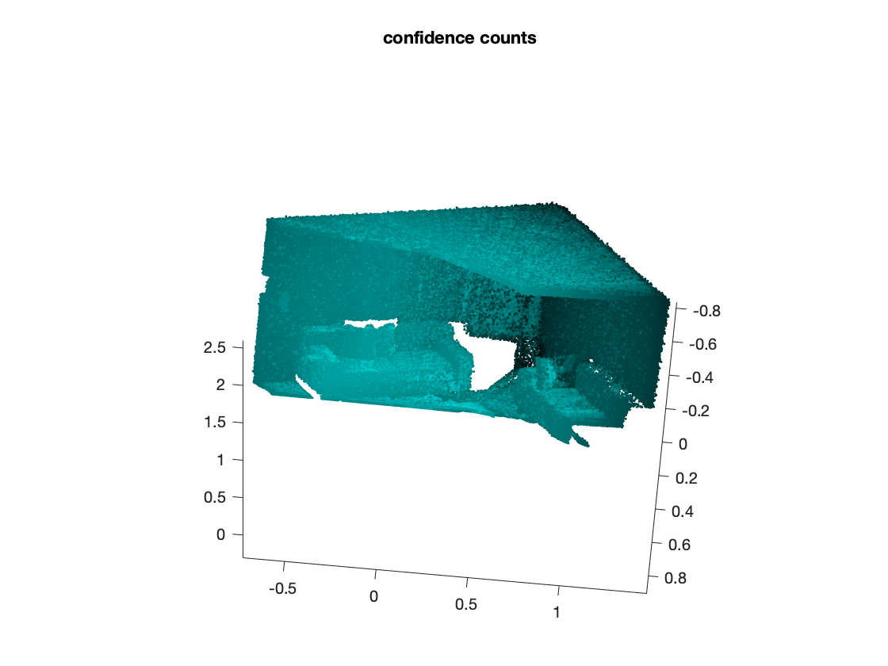
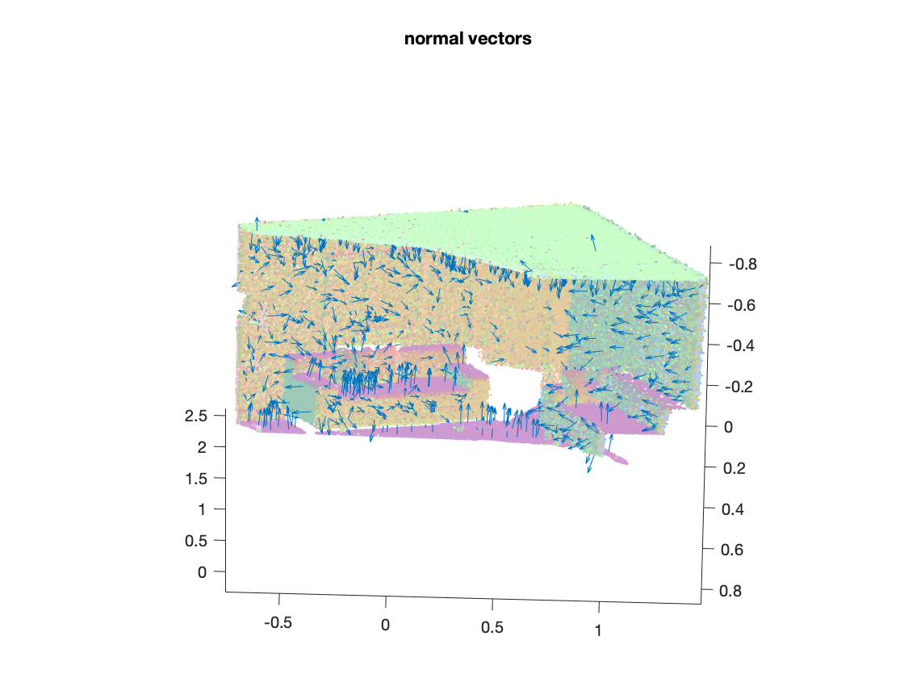
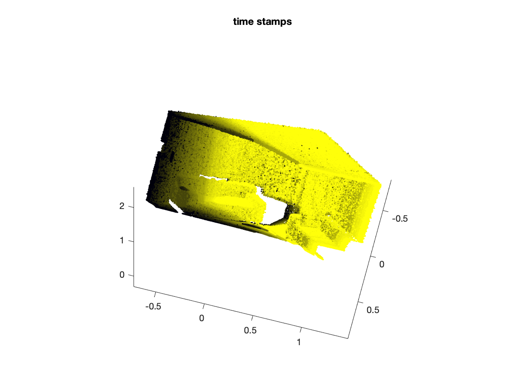

# ICP and Point Fusion for 3D Reconstruction

-----------------------

ICP based reconstruction

  

-----------------------

ICP + point fusion based reconstruction

  

-----------------------

Confidence counts, normals and timestamps for the reconstructed scene

  

-----------------------